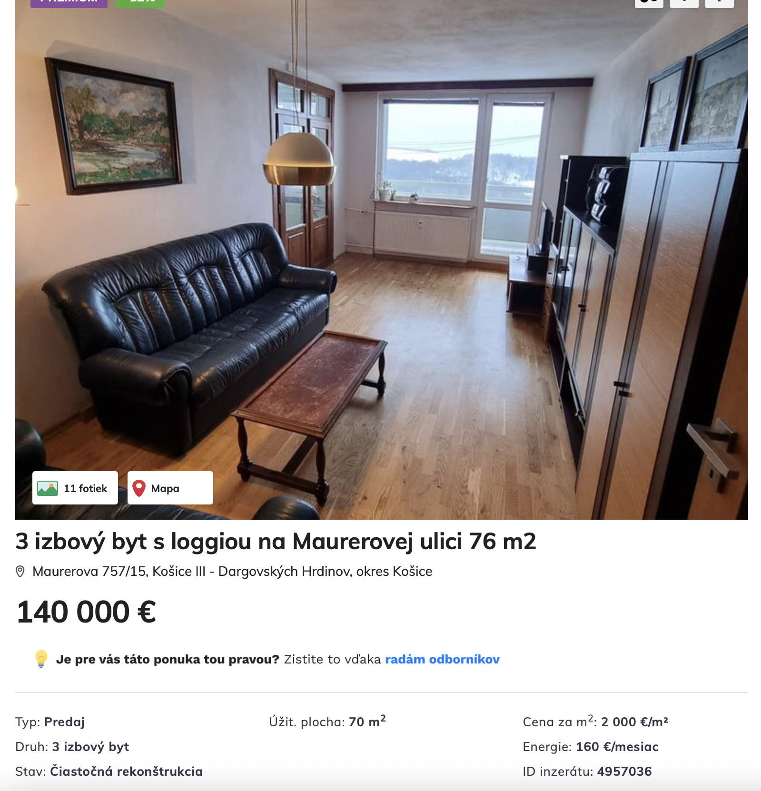
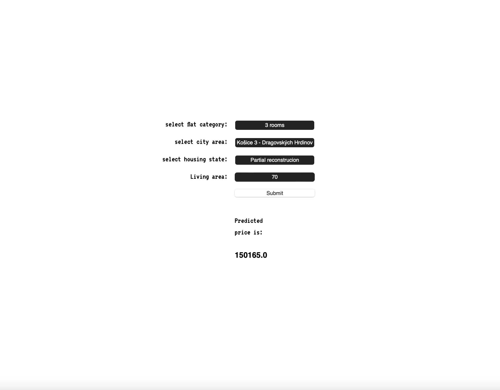

## About flat:|:AI

Our solution utilizes a neural network model to determine the value of flats in the city of Kosice.
By leveraging the power of artificial intelligence, we aim to provide predictions for real estate prices.    
     
The neural network architecture employed in our solution has been trained on a comprehensive dataset that incorporates various factors influencing flat prices, such as location, size, number of rooms and other relevant features. Through a process of iterative learning, the neural network has gained the ability to identify complex patterns and relationships within the data,
enabling it to make informed predictions on flat values.     
     
By leveraging this technology, potential buyers, sellers, and real estate professionals can make well-informed decisions and gain valuable insights
into the market conditions.   

### Usecase

<figure>
    
    <figcaption>Real world flat advertised for sale.</figcaption>
</figure>   

------------------------     

<figure>
    
    <figcaption>Flat AI estimates value of specific flat.</figcaption>
</figure>    

